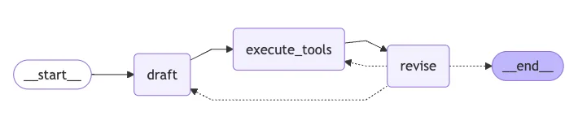

# Reflexion Agent

## v1
Create chains for AI-powered research functionality - Corresponds to Lecture 17: Actor Agent
Implemented the first component of our agent architecture - the Actor
Added chains.py with prompt templates for generating detailed answers
Created schemas.py with Pydantic models for structured data handling

## v2
Enhance chains for answer revision capabilities - Corresponds to Lecture 18: Revisor Agent
Implemented the second component - the Revisor for self-reflection
Added ReviseAnswer class to schemas.py for improved response structure
Updated chain prompts to incorporate critique and citation requirements

## v3
Add dependencies and tools for graph nodes - Corresponds to Lecture 19: ToolNode - Executing Tools
Integrated search functionality to enhance response accuracy
Added required dependencies for the complete graph workflow

## v4
Implement the complete message graph - Corresponds to Lecture 20: Building our LangGraph Graph
Connected Actor and Revisor agents in a complete LangGraph workflow
Defined graph nodes for drafting, tool execution, and revision
Established state management and conditional edge routing for reflection

## project 
- https://github.com/emarco177/reflexion
- https://github.com/emarco177/langgraph-course/tree/project/reflexion-agent
